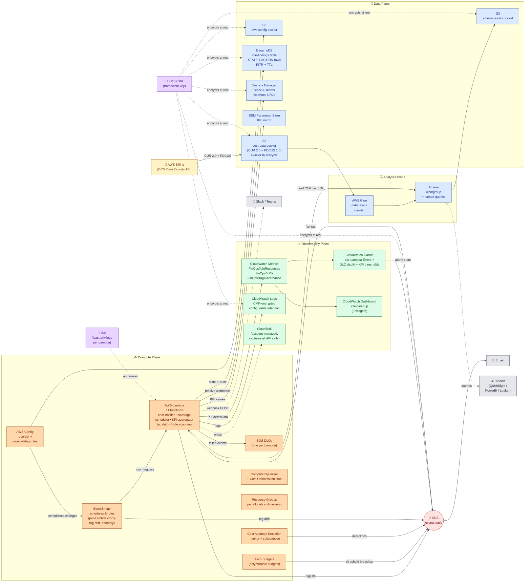

# AWS Architecture — High-Level View

This diagram shows the AWS services the framework provisions and how they connect at a logical level. Encryption, IAM, and operational scaffolding are factored out as cross-cutting boxes to keep the data flow legible.

## What it shows at a glance

- **One data lake on S3**, one query layer (Glue + Athena), one state store (DynamoDB), one events bus (SNS). The framework is structurally simple — the cleverness is in the lifecycle logic on top.
- **Every Lambda has the same shape**: triggered by EventBridge → reads from Athena/DDB → writes to DDB (audit) + CloudWatch (metrics) + SNS (digest). Failures go to per-Lambda DLQs.
- **Encryption is uniform**: a single CMK encrypts S3, DDB, Secrets Manager, SNS, CloudWatch Logs. No encryption gaps.
- **Observability is uniform**: every Lambda emits to CloudWatch metrics under a `FinOps/*` namespace; every Lambda has Errors + DLQ-depth alarms.
- **External integrations are explicit**: chat notifier resolves webhooks from Secrets Manager and POSTs to Slack/Teams; BI tools query Athena directly.

## Cross-cutting concerns

| Concern | How it shows up |
|---|---|
| Encryption at rest | KMS CMK → S3 / DDB / Secrets Manager / SNS / CloudWatch Logs |
| Encryption in transit | TLS-only S3 bucket policy; SNS HTTPS subscriptions |
| Audit trail | CloudTrail (assumed enabled at account level) + DDB ACTION rows with 7-year TTL |
| Least privilege | One IAM role per Lambda with action-and-resource-scoped statements |
| Recovery | `prevent_destroy` on KMS / cost-data S3 / DDB findings table |
| Cost discipline | Glacier IR (not Deep Archive) on current CUR data; Pay-per-request DynamoDB; Lambda free-tier-friendly |

## Operational gotchas highlighted by the diagram

- The crawler step (`S3CUR → GLUE → ATHENA`) is **eventually consistent** — first apply has a ~24-48h delay before Athena queries return data.
- Cost Anomaly Detection has its own 14-day learning window before alerts become useful — the diagram doesn't show that latency, but it's a real first-month operational note.
- DLQs are per-Lambda — there's no single "framework DLQ" to query; each Lambda has its own.
