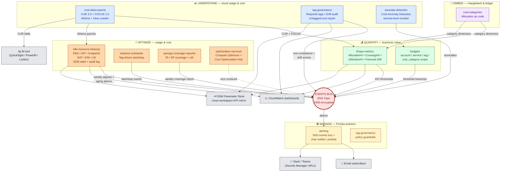

# Framework Structure — FinOps Foundation Capability Map

This diagram shows the framework's modules grouped by the five [FinOps Foundation Capability domains](https://www.finops.org/framework/), and how findings, KPIs, and alerts flow through the central events bus.

The **events SNS topic** is the spine: every module that produces a signal publishes there, and every consumer (chat notifier, downstream subscribers) attaches there.

## How to read this diagram

- **Coloured groups** = FinOps Foundation Capability domains. Each module sits in the domain(s) it primarily serves.
- **The red bus** = single SNS events topic. Every module publishes here; the chat notifier and email subscribers consume from here. One topic, many channels.
- **Solid arrows** = synchronous data dependencies (e.g., `finops-metrics` queries the `cost-data-exports` Athena tables).
- **Solid arrows into the bus** = asynchronous events (alerts, anomalies, digests, alarms).
- **Dotted arrows** = informational / optional flows.

## Module-to-capability cross-reference

| Module | Primary capability | Secondary capability |
|---|---|---|
| `cost-data-exports` | Data Ingestion & Normalization | Reporting & Analytics |
| `cost-categories` | Allocation | Chargeback & Ledger |
| `tag-governance` | Policy & Governance | Allocation, Reporting |
| `anomaly-detection` | Anomaly Management | — |
| `budgets` | Budgeting | Forecasting |
| `finops-metrics` | Reporting & Analytics | Benchmarking, Unit Economics |
| `optimization-services` | Architecting for Cloud | Workload Optimization |
| `idle-resource-cleanup` | Workload Optimization | — |
| `instance-scheduler` | Workload Optimization | — |
| `savings-coverage-reporter` | Rate Optimization | — |
| `alerting` | FinOps Practice Operations | — |
